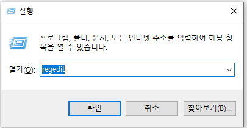
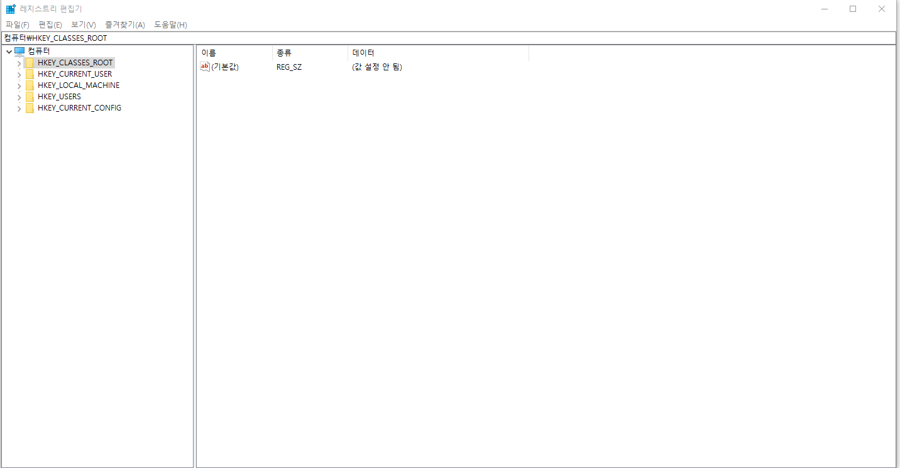
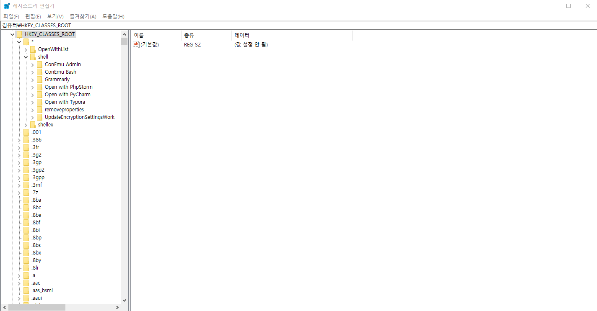
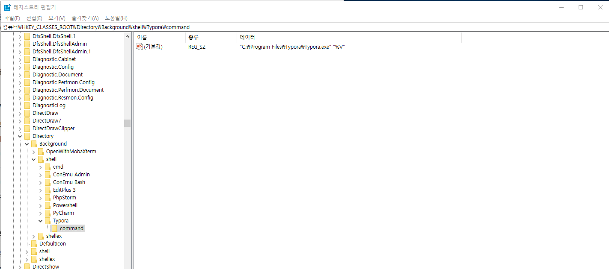
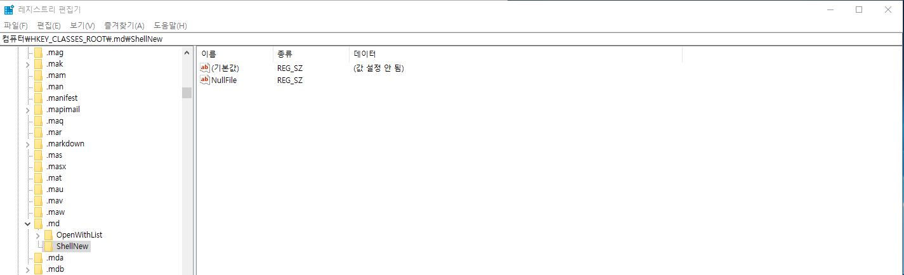

# Registry

윈도우 레지스트리는 윈도우계열 시스템에서 사용하는 시스템 구성 정보를 저장한 데이터베이스를 말한다.

레지스트리는 키와 값이라는 두가지  기본 요소를 포함하고 있다. 

**키** 

* 폴더와 비슷하다

* 각 키는 서브키를 가질 수 있다.

* 계급 수준을 지시하기 위해 백슬래시를 사용한다.
  * HKEY_LOCAL_MACHINE\Software\Microsoft\Windows

**값**

* 키 안에 들어 있는 이름/자료이다.
* 값은 여러 키로부터 참조 할 수 있다.
* 값 이름은 백슬래시를 포함할 수 있다.

## 레지스트리 값 종류

| 값                                | 의미                                                         |
| --------------------------------- | ------------------------------------------------------------ |
| REG_NONE                          | 종류 없음                                                    |
| REG_EXPAND_SZ                     | 확장할 수 있는 문자열 값. 환경 변수를 포함할 수 있다.        |
| REG_BINARY                        | 이진값 (임의의 데이터)                                       |
| REG_DWORD/REG_DWORD_LITTLE_ENDIAN | DWORD 값 (32 비트) 정수 (0 ~ 4,294,967,295 [232 – 1]) (리틀 [엔디언](https://ko.wikipedia.org/wiki/%EC%97%94%EB%94%94%EC%96%B8)) |
| REG_DWORD_BIG_ENDIAN              | DWORD 값 (32 비트) 정수 (0 ~ 4,294,967,295 [232 – 1]) (빅 [엔디언](https://ko.wikipedia.org/wiki/%EC%97%94%EB%94%94%EC%96%B8)) |
| REG_LINK                          | 심볼 링크 (유니코드)                                         |
| REG_MULTI_SZ                      | 다중 문자열 값 (고유한 [문자열](https://ko.wikipedia.org/wiki/%EB%AC%B8%EC%9E%90%EC%97%B4)의 배열) |
| REG_RESOURCE_LIST                 | 리소스 목록 (플러그 앤 플레이 하드웨어 열거 및 구성에 쓰임)  |
| REG_FULL_RESOURCE_DESCRIPTOR      | 리소스 서술자 (플러그 앤 플레이 하드웨어 열거 및 구성에 쓰임) |
| REG_RESOURCE_REQUIREMENTS_LIST    | 리소스 요구 목록 (플러그 앤 플레이 하드웨어 열거 및 구성에 쓰임) |
| REG_QWORD/REG_QWORD_LITTLE_ENDIAN | QWORD 값 (64 비트 정수), 빅/리틀 엔디언 또는 정의되지 않음 ([윈도우 2000](https://ko.wikipedia.org/wiki/%EC%9C%88%EB%8F%84%EC%9A%B0_2000)에 도입) |

## 편집

레지스트리 편집은 레지스트리 편집 프고그램을 이용한다. 

WIN + R

=======

어떤 파일을 선택한 후 마우스 오른쪽 버튼으로 실행하고 싶을 때는 HKEY_CLASSES_ROOT > * > shell 키에 서브 키를 만들어서 실행할 command를 입력한다.

* 실행할 서브키를 만든다

* 서브키 안의 기본 값은 오른쪽 버튼을 눌렀을때 보여주는 글자이다.

* Icon값을 만들어서 아이콘을 삽입 할 수 있다.

* 실행할 서브키 안에 command키를 만든 후 문자열 값을 만들어 실행할 프로그램의 command를 작성한다.

=======
### 예제(Typora 실행)

1. 레지스트리 편집기 실행
2. shell 키 하위에 typora 서브키 생성
3. Typora 서브키의 기본값에 Edit With Typora 입력
4. Icon 문자열 값 생성 후 아이콘 PATH 설정 (C:\Program Files\Typora\Typora.exe)
5. Typora 서브키 하위에 command 서브키 생성
6. command 서브키 기본값에 프로그램 PATH 설정 ("C:\Program Files\Typora\Typora.exe" "%1")

## 실행

마우스 오른쪽 버튼으로 프로그램을 실행할 때는 레지스트리 편집기에서 HKEY_CLASSES_ROOT > Directory > Background > shell 키에서 서브키를 생성하여 command를 입력한다.

- 실행할 서브키를 만든다
- 서브키 안의 기본 값은 오른쪽 버튼을 눌렀을때 보여주는 글자이다.
- Icon값을 만들어서 아이콘을 삽입 할 수 있다.
- 실행할 서브키 안에 command키를 만든 후 문자열 값을 만들어 실행할 프로그램의 command를 작성한다

### 예제(Typora 실행)

1. 레지스트리 편집기 실행
2. shell 키 하위에 typora 서브키 생성
3. Typora 서브키의 기본값에 Open Typora 입력
4. Icon 문자열 값 생성 후 아이콘 PATH 설정 (C:\Program Files\Typora\Typora.exe)
5. Typora 서브키 하위에 command 서브키 생성
6. command 서브키 기본값에 프로그램 PATH 설정 ("C:\Program Files\Typora\Typora.exe" "%V")

=======

## 새 파일 만들기

마우스 오른쪽 버튼에서 새로만들기로 새 파일을 만들려고 할때는 해당 파일 확장자 명에 해당하는 키로 이동하여

ShellNew 키를 만든후 NullFile 값을 만들면 된다.

### 예제(MarkDown 파일 새로 만들기)

1. HKEY_CLASSES_ROOT > .md 키 하부에 ShellNew 서브키를 생성한다.
2. NullFile 값을 생성한다.

=======

