# VSCode 확장 프로그램

1. Remote - SSH

   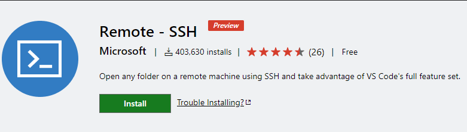

   ssh를 통해서 원격지의 코드에 접속해서 코딩환경을 제공해주는 도구

   사용방법

   1. `F1`키를 누른후 Remote-SSH: Open SSH Host..선택

      

   2. `Add New SSH Host..` 선택하여 Host 이름 지정

   3. config 파일 설정 `C\Users\사용자이름\config`

   4. config 파일 설정

      ```bash
      Host 호스트 이름
          HostName 호스트 아이피
          User 호스트 사용자 이름
      ```

      

   

   

2. Material Theme

   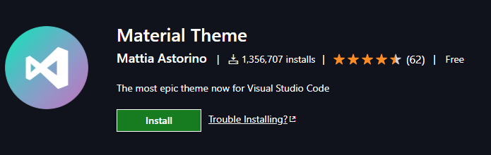

   Material Theme의 테마를 사용할 수 있도록 해줌

3. Material Icon Theme

   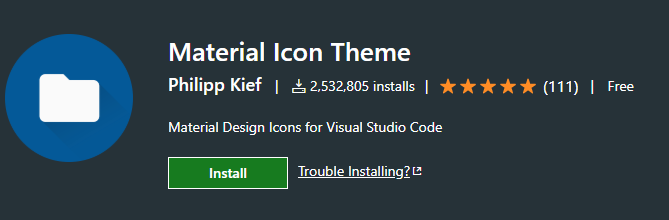

   Material Theme의 아이콘 테마를 사용할 수 있도록 해줌

4. Auto Rename Tag

   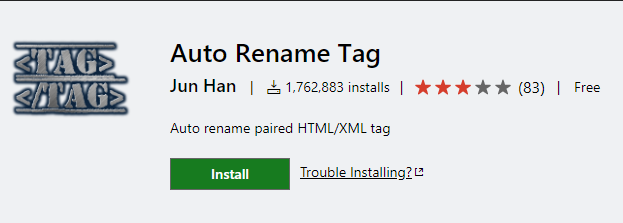

   자동으로 HTML/XML 태그 쌍의 이름을 변경해줌

   

5. Rainbow Brackets

   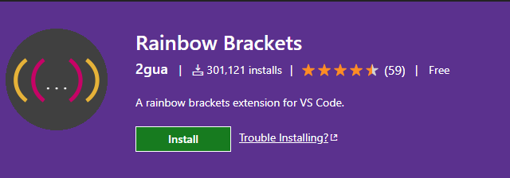

   열고 닫는 괄호 쌍의 색을 구분해서 복잡한 괄호 문구에서 쉽게 식별하도록 해줌

6. TODO Highlight

   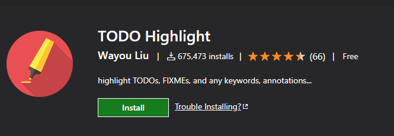

   TODO, FIXME 주석에 대해서 인식하기 쉽도록 하이트라이트 해줌

   

7. Todo Tree

   

   Todo list를 보여줌

   

8. CSS Peek

   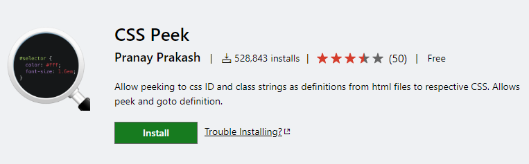

   HTML에서 class에 해당하는 css로 바로 향하게 해준다 `Ctrl + hover`

   

   

9. Document This

   Javascript와 Typescript에서 JsDoc comment를 자동으로 생성해주는 도구

   

10. Path Intellisense

    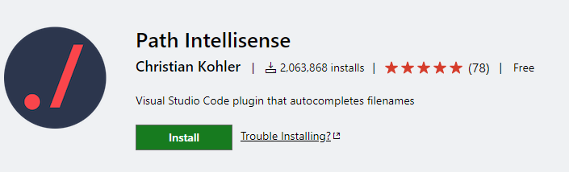

    현재 경로를 인식하고 자동완성 해주는 도구

    nodepackage intellisense관해서는 npm Intellisense 확장 프로그램을 사용하라고 하는데, path intellisense만 설치해도 node package 확인 가능하다.

    

11. IntelliSense for CSS, SCSS class names in HTML, Slim and SCSS

    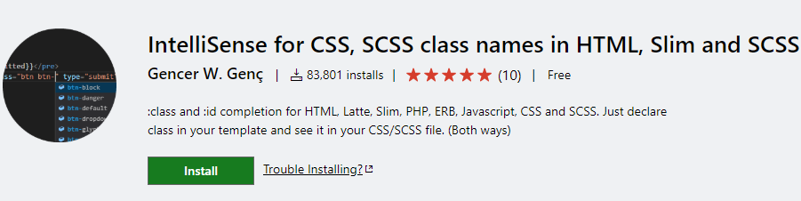

    HTML에서 class 이름을 작성할때 자동완성 기능을 제공한다.

    

12. PHP IntelliSense

    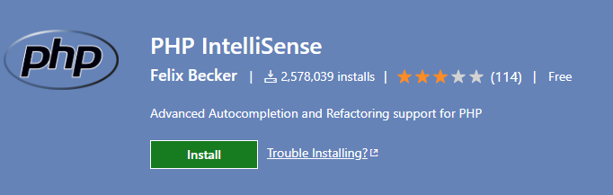

    PHP관련 자동완성 기능 제공

    

13. Prettier - Code formatter

    

    파일을 이쁘게 자동 reformat해줌

    **매 저장(ctrl + s)시마다 바로바로 코드가 정리**될 수 있도록 할 수 있다.

    1. `prettier` 를 설치한다

    2. `vscode` 설정에 들어간다.

    3. **사용자 설정은 모든 곳에 적용되는 곳**이고, 작업 영역 설정은 **지금 바로 이 작업 환경(디렉토리)에서만 적용**되는 설정이다. 취향껏 고르자.

    4. 검색창에 `format on save` 를 입력해보자. 저장할 때마다 서식을 지정한다는 뜻이다.

       

    5. 위 그림과 같이 체크한다.

    6. 잘 되었나 확인해보고 싶으면 뒤죽박죽인 자신의 코드에서 `ctrl` + `s`로 **저장**해보자.

    7. 아니면 설정 검색창에서 `setting.json` 를 검색하고, 편집 버튼을 눌러 살펴보자.

14. ESLint

    

    자바스크립트 ECMAscript기반 Lint 도구

15. Debugger for Chrome

    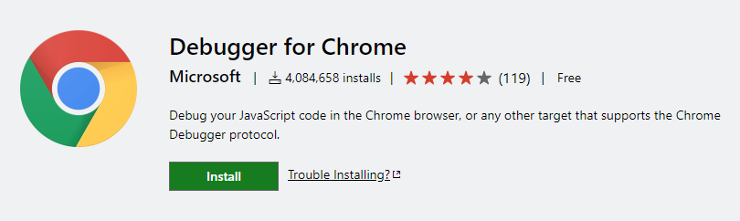

    vscode에서 chrom devtool을 사용하요 debugging할 수 있도록 해주는 도구

    


> IntelliSenese란?
>
> IntelliSense는 다음과 같은 다양한 기능을 포함하는 코드 완성 지원 도구입니다. 멤버 목록, 매개 변수 정보, 요약 정보 및 전체 단어. 이러한 기능을 사용하면 사용 중인 코드에 대한 자세한 정보를 보고, 입력하는 매개 변수를 계속 추적하고, 단 몇 번의 키 입력만으로 속성과 메서드에 대한 호출을 추가할 수 있습니다.